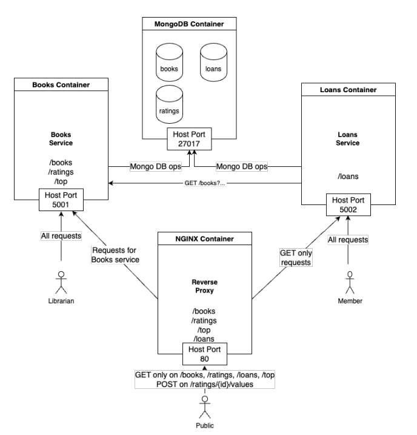

# Library Management System

This project is a **Library Management System**, developed in Python using Flask, structured in a microservices architecture. It utilizes Docker Compose to orchestrate various services, making it a highly modular and scalable application.

## Project Overview

The Library Management System consists of four main services:

- **Books Service**: Manages information about books in the library.
- **Loans Service**: Tracks and handles loans of books to members.
- **MongoDB Service**: Serves as the database for storing data related to books, ratings, and loans.
- **NGINX Reverse Proxy**: Directs traffic to the appropriate service and enforces access policies.

## Architecture

The application is composed of the following Docker containers:

- **Books Container**: Hosts the Books Service, which is responsible for managing library books, their ratings, and popular books.
- **Loans Container**: Hosts the Loans Service, which manages loan requests for books.
- **MongoDB Container**: Stores data about books, loans, and ratings. Communicates with both Books and Loans services for data persistence.
- **NGINX Container**: Acts as a reverse proxy, routing requests to the Books and Loans services and enforcing access policies. It listens on port 80 and routes traffic to the respective service based on request type.

## Diagram

## Services and Endpoints

- **Books Service** (`/books`, `/ratings`, `/top`): Accessible on port 5001. Handles requests related to books, including fetching book information, getting ratings, and listing top-rated books.
- **Loans Service** (`/loans`): Accessible on port 5002. Handles requests for managing book loans.
- **NGINX Proxy**: Routes requests to the appropriate service based on URL path and access policy. It enforces read-only access for public users and full access for specific roles (e.g., librarians).

## Access Policies

The NGINX Reverse Proxy enforces access policies as follows:

- **Public**: Can make GET requests on `/books`, `/ratings`, `/top`, and `/loans`, and POST requests to `/ratings/{id}/values`.
- **Librarian**: Full access to Books Service endpoints.
- **Member**: Access to GET requests on Loans Service endpoints.

## Technologies Used

- **Python (Flask)**
- **Docker & Docker Compose**
- **MongoDB (Database)**
- **NGINX (Reverse Proxy)**

